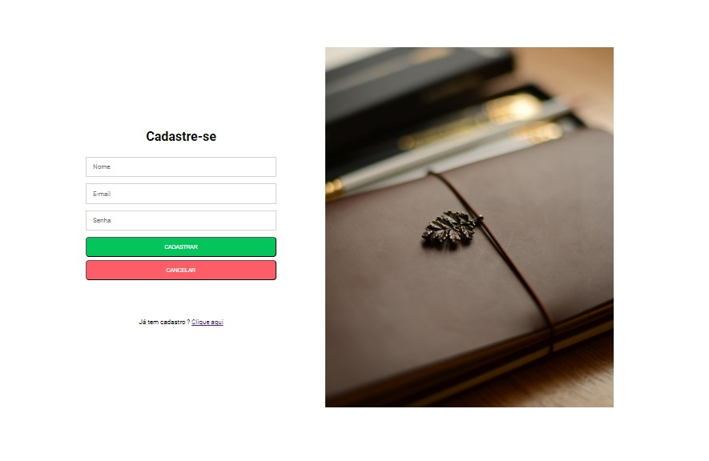
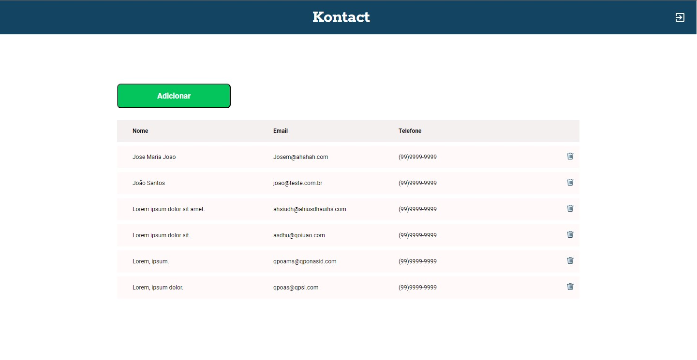

# kontact
# agenda-de-contatos-Kontact
Projeto de uma agenda de contatos feita como desafio prático do curso de desenvolvimento de software na cubos academy

## Página de Login

Nesta página o usuário pode fazer login

## Página de cadastro

Nesta página o usuário pode se cadastrar

## Página de contatos

Essa página mostra o botão para adicionar novo contato.Clicando no ícone de excluir, abre o modal de confirmação para exclusão do contato

## Como Executar o projeto

Para executar o projeto basta fazer um fork para o seu repositório ou baixar o projeto.zip e executar o index.html no seu navegador

## Futuras implementações

scripts javaScript para implementar a inclusão e exclusão de contatos.
